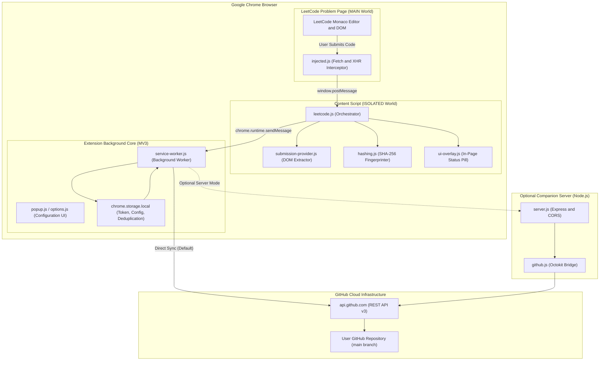
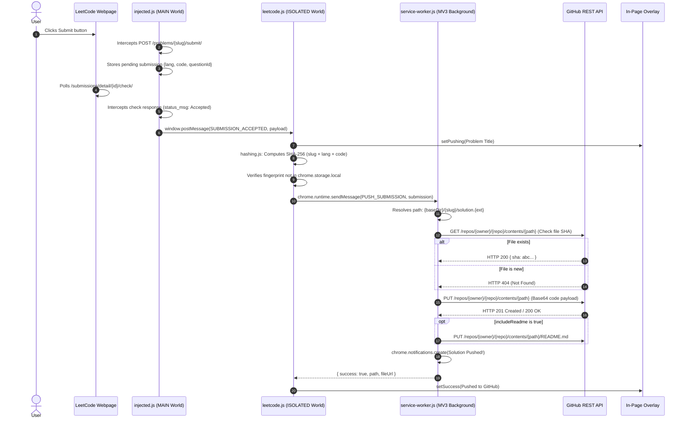

# 🏗️ LeetPush — Comprehensive Technical Architecture & Working Guide

**LeetPush** is a developer productivity tool that automatically captures accepted problem submissions on LeetCode and commits them cleanly to a user's GitHub portfolio repository in real time.

This document details the system design, internal component mechanics, runtime lifecycle, and security model.

---

## 📑 Table of Contents

1. [Executive Architectural Summary](#1-executive-architectural-summary)
2. [Dual-Mode Operating Model](#2-dual-mode-operating-model)
3. [Component Hierarchy & Responsibilities](#3-component-hierarchy--responsibilities)
4. [Step-by-Step Runtime Lifecycle](#4-step-by-step-runtime-lifecycle)
5. [Core Engineering Mechanisms](#5-core-engineering-mechanisms)
   - [5.1 Page-Level Network Interception (`injected.js`)](#51-page-level-network-interception-injectedjs)
   - [5.2 Strict "Submit" vs "Run Code" Discrimination](#52-strict-submit-vs-run-code-discrimination)
   - [5.3 Multi-Strategy Metadata & Code Extraction (`submission-provider.js`)](#53-multi-strategy-metadata--code-extraction-submission-providerjs)
   - [5.4 Anti-Duplicate Fingerprinting (`hashing.js`)](#54-anti-duplicate-fingerprinting-hashingjs)
   - [5.5 Direct GitHub REST API Synchronization (`service-worker.js`)](#55-direct-github-rest-api-synchronization-service-workerjs)
   - [5.6 Automated Problem README Generation](#56-automated-problem-readme-generation)
   - [5.7 Floating In-Page Overlay (`ui-overlay.js`)](#57-floating-in-page-overlay-ui-overlayjs)
6. [Data Schemas & Storage Model](#6-data-schemas--storage-model)
7. [Repository File & Directory Structure](#7-repository-file--directory-structure)
8. [Security & Token Isolation Model](#8-security--token-isolation-model)

---

## 1. Executive Architectural Summary



---

## 2. Dual-Mode Operating Model

LeetPush is engineered to support two distinct operational topologies:

| Mode | Target User | How It Works | Strengths |
| :--- | :--- | :--- | :--- |
| **Standalone Direct Mode** *(Default & Recommended)* | All users / Chrome Web Store installs | Extension communicates directly with `https://api.github.com/*` using Chrome's background service worker. | **Zero local setup**: No Node.js, no terminal, no port conflicts, starts automatically with browser. |
| **Companion Server Mode** *(Optional)* | Advanced local power users | Extension relays payloads to `http://localhost:3000/push`, where a local Node.js Express server commits via Octokit. | GitHub Personal Access Token is stored strictly in `server/.env` on the local filesystem. |

---

## 3. Component Hierarchy & Responsibilities

### Extension Layer (`extension/`)

```
extension/
├── manifest.json              # MV3 configuration, host permissions, resources
├── icons/                     # 16, 32, 48, 128 px extension icons
├── styles/
│   └── content.css            # Floating status pill styling
└── src/
    ├── background/
    │   └── service-worker.js  # Direct GitHub REST synchronization & notifications
    ├── content/
    │   ├── injected.js        # Main-world fetch/XHR network interceptor
    │   ├── leetcode.js        # Content script orchestrator & DOM observer fallback
    │   ├── submission-provider.js # Multi-strategy title, slug, language, & code extraction
    │   └── ui-overlay.js      # Floating in-page status widget
    ├── popup/
    │   ├── popup.html         # Toolbar quick-connect interface
    │   ├── popup.css          # Glassmorphic dark popup styling
    │   └── popup.js           # Repository URL parser & token validation
    ├── options/
    │   ├── options.html       # Full-page settings dashboard
    │   ├── options.css        # Settings theme styles
    │   └── options.js         # Branch, directory, and feature toggles
    └── utils/
        ├── hashing.js         # Web Crypto SHA-256 fingerprinting
        └── languages.js       # 18+ programming language extension mapper
```

---

## 4. Step-by-Step Runtime Lifecycle



---

## 5. Core Engineering Mechanisms

### 5.1 Page-Level Network Interception (`injected.js`)

In Manifest V3, content scripts run inside an **Isolated World** where they cannot directly monkey-patch the target page's `window.fetch` or `XMLHttpRequest` instances.

**The Solution:**
1. `leetcode.js` dynamically creates a `<script>` tag referencing `src/content/injected.js` declared under `web_accessible_resources`.
2. The script executes directly in the **MAIN World** (page context).
3. It monkey-patches both `window.fetch` and `XMLHttpRequest.prototype.open / send`.

```javascript
// Intercepting fetch inside page context
const originalFetch = window.fetch;
window.fetch = async function(...args) {
  const url = typeof args[0] === "string" ? args[0] : args[0]?.url || "";
  handleOutgoingRequest(url, args[1]?.body);

  const response = await originalFetch.apply(this, args);
  if (url.includes("/check/") || url.includes("/submit/")) {
    const clone = response.clone();
    clone.json().then(data => handleSubmissionResponse(url, data)).catch(() => {});
  }
  return response;
};
```

---

### 5.2 Strict "Submit" vs "Run Code" Discrimination

One of the most frequent problems in LeetCode tools is accidentally pushing code when a user merely clicks **"Run Code"** to test a sample case.

LeetPush implements a **3-tier safeguard system**:
1. **Endpoint Differentiation**:
   - Outgoing calls containing `/interpret_solution/` or `/test/` immediately clear all pending state (`activeSubmission = null`).
   - Only outgoing calls matching `/problems/{slug}/submit/` initialize an `activeSubmission`.
2. **Polling ID Verification**:
   - The intercepted polling checks (`/submissions/detail/{id}/check/`) are explicitly validated against `activeSubmission.submissionId`.
   - Checks with `interpret_id`, `mysubmission`, or `interpret_status_code` are strictly dropped.
3. **DOM Click Listener Verification**:
   - `leetcode.js` tracks button clicks in capture phase (`e2e === "console-submit-button"` vs `e2e === "console-run-button"`).
   - If the fallback `MutationObserver` triggers, it checks whether a real Submit click occurred within the last 90 seconds.

---

### 5.3 Multi-Strategy Metadata & Code Extraction (`submission-provider.js`)

LeetCode frequently updates its DOM class names. To prevent breakage, `LeetCodeSubmissionProvider` implements redundant extraction heuristics:

#### A. Title & Slug Extraction
- **Slug**: Extracted reliably from `window.location.pathname` (`/problems/{slug}/`).
- **Title**:
  - *Strategy 1*: `[data-cy="question-title"]`
  - *Strategy 2*: Header selectors (`div[class*="text-title-large"]`, `h1`)
  - *Strategy 3*: `document.title` parsed before hyphen (e.g. `1. Two Sum`)
  - *Strategy 4*: Title-cased slug fallback.

#### B. Language Detection
- *Strategy 1*: LeetCode `localStorage` (`global_lang`, `last_selected_lang`).
- *Strategy 2*: Monaco Editor DOM `[data-mode-id]` attribute.
- *Strategy 3*: Editor toolbar language selector dropdown button text.
- *Strategy 4*: Submission result panel language pill text.

#### C. Code Extraction
- *Primary*: Intercepted JSON payload (`typed_code` or `code`) captured directly from the submission network request. This guarantees exact submitted code rather than subsequent editor typing.
- *Fallback*: Monaco editor line traversal (`.monaco-editor .view-line`) or hidden textarea.

---

### 5.4 Anti-Duplicate Fingerprinting (`hashing.js`)

To prevent spamming the user's Git commit history when resubmitting or repeatedly clicking submit:

$$\text{Fingerprint} = \text{SHA-256}\Big(\text{slug} \parallel \text{language} \parallel \text{normalizedCode}\Big)$$

1. Code is normalized (trimmed, `\r\n` converted to `\n`).
2. Web Crypto API (`crypto.subtle.digest("SHA-256", ...)`) computes a 64-character hexadecimal digest.
3. The digest is checked against `chrome.storage.local.get(["synced_fingerprints"])`.
4. If found, the push is cancelled with a `"Duplicate Submission"` UI state.
5. If new, the push executes and the digest is saved to a FIFO ring buffer capped at the last 1,000 fingerprints.

---

### 5.5 Direct GitHub REST API Synchronization (`service-worker.js`)

The background service worker commits files atomically using the GitHub Contents API:

1. **Existence Check (`GET`)**:
   ```http
   GET https://api.github.com/repos/{owner}/{repo}/contents/{path}?ref={branch}
   Authorization: Bearer {token}
   ```
   - If `200 OK`: File exists. Captures `fileData.sha` to perform an update.
   - If `404 Not Found`: File is new. Proceed with `existingSha = null`.

2. **Commit File (`PUT`)**:
   ```http
   PUT https://api.github.com/repos/{owner}/{repo}/contents/{path}
   Authorization: Bearer {token}
   Content-Type: application/json

   {
     "message": "leetcode: add two-sum (python3) [44 ms]",
     "content": "<base64-encoded-code>",
     "branch": "main",
     "sha": "<existingSha-if-updating>"
   }
   ```

3. **Unicode-Safe Base64 Encoding**:
   Standard `btoa()` crashes on non-ASCII characters (e.g. comments with accents, emojis, or non-Latin scripts). LeetPush uses:
   ```javascript
   const base64Code = btoa(unescape(encodeURIComponent(code)));
   ```

---

### 5.6 Automated Problem README Generation

When `includeReadme` is enabled, LeetPush creates or updates a formatted `README.md` alongside the solution file:

```markdown
# 1. Two Sum


**LeetCode Problem**: [View on LeetCode](https://leetcode.com/problems/two-sum/)

## Description

Given an array of integers `nums` and an integer `target`...

---
*Auto-synced with [LeetPush](https://github.com/RIKKY-J/LeetPush)*
```

---

### 5.7 Floating In-Page Overlay (`ui-overlay.js`)

Injected directly into the LeetCode problem page DOM (`#leetpush-overlay-container`), this glassmorphic card provides visual feedback:

| State | Visual Indicator | Details Displayed |
| :--- | :--- | :--- |
| **Ready** | Pulsing green dot | `GitHub Sync: Ready` |
| **Pushing** | Pulsing yellow/indigo dot | `Pushing Two Sum to GitHub...` |
| **Success** | Solid emerald badge | `✅ Synced to main` + clickable GitHub file link |
| **Duplicate**| Amber badge | `Already synced (identical code)` |
| **Error** | Red badge | Specific error message + `Retry` button |

---

## 6. Data Schemas & Storage Model

All persistent client data is kept in `chrome.storage.local`:

```json
{
  "settings": {
    "repoUrl": "https://github.com/username/leetcode-practice",
    "owner": "username",
    "repo": "leetcode-practice",
    "branch": "main",
    "baseDir": "leetcode",
    "githubToken": "ghp_xxxxxxxxxxxxxxxxxxxx",
    "autoPush": true,
    "acceptedOnly": true,
    "includeReadme": true,
    "showNotifications": true
  },
  "synced_fingerprints": [
    "e3b0c44298fc1c149afbf4c8996fb92427ae41e4649b934ca495991b7852b855",
    "a591a6d40bf420404a011733cfb7b190d62c65bf0bcda32b57b277d9ad9f146e"
  ],
  "last_submission": {
    "title": "Two Sum",
    "slug": "two-sum",
    "language": "python3",
    "timestamp": "2026-10-07T12:00:00.000Z",
    "path": "leetcode/two-sum/solution.py",
    "fileUrl": "https://github.com/username/leetcode-practice/blob/main/leetcode/two-sum/solution.py"
  }
}
```

---

## 7. Repository File & Directory Structure

When synced to your GitHub repository, solutions are organized hierarchically:

```text
your-github-repo/
└── leetcode/                               # Configurable baseDir
    ├── two-sum/
    │   ├── README.md                       # Auto-generated problem description & badge
    │   └── solution.py                     # Python solution
    ├── valid-parentheses/
    │   ├── README.md
    │   ├── solution.cpp                    # C++ solution
    │   └── solution.java                   # Multi-language solutions co-exist cleanly
    └── longest-consecutive-sequence/
        ├── README.md
        └── solution.rs                     # Rust solution
```

---

## 8. Security & Token Isolation Model

1. **Client-Side Isolation**:
   - The user's GitHub Personal Access Token is stored exclusively in `chrome.storage.local`.
   - Browser extensions have origin-sandboxed local storage that cannot be accessed by external web scripts or pages.
2. **Zero Middleman Servers**:
   - Standalone Direct Mode does not use any relay server. API calls travel via HTTPS directly between the browser and `api.github.com`.
3. **Least Privilege Permissions**:
   - Extension requests only `storage` and `notifications`.
   - Host permissions are restricted strictly to `https://leetcode.com/*`, `https://leetcode.cn/*`, and `https://api.github.com/*`.
4. **Token Generation Scoping**:
   - Only the minimal `repo` scope is required to write solution commits.
